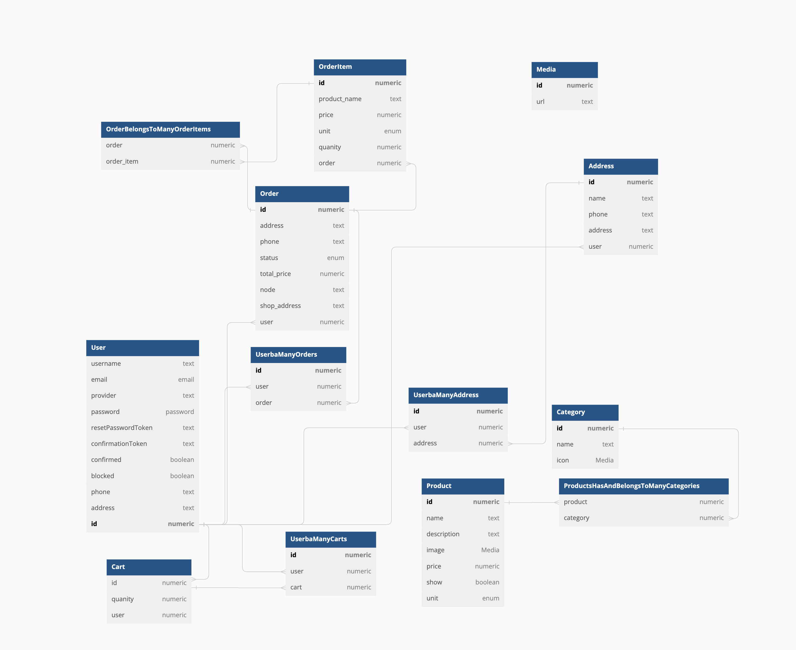

# Ứng thương mại điện tử

## Giới thiệu

### Các thành viên

-   Lê Thị Thuỳ Dung - 20001895 (`C`)
-   Bùi Khánh Duy - 20001898
-   Phạm Bá Thắng - 20001976
-   La Thị Anh Thư - 20001980

### Mô tả

App bán hàng hoa quả online App được sử dụng để chủ cửa hàng đăng lên các sản phẩm cùng giá cả từng mặt hàng và ưu đãi kèm theo (nếu có). Người mua có thể xem danh sách các mặt hàng trong cửa hàng, lưu lại các sản phẩm mình ưng ý vào giỏ hàng và mua sản phẩm nếu có nhu cầu với các dịch vụ ship hàng tận nơi Đối tượng hướng đến: khách hàng có nhu cầu xem và mua hoa quả Cách sử dụng:

###

-   Tải app về …
-   Đăng ký tài khoản bằng gmail, tạo password của riêng mình, đăng nhập lại bằng gmail
-   React native 0.71.1, strapi 4.6.1, react 18.2.0

### Chức của ứng dụng

-   [x] Đăng nhập, đăng ký
-   [x] Xem danh sách sản phẩm
-   [x] Xem chi tiết sản phẩm
-   [x] Thêm sản phẩm vào giỏ hàng
-   [x] Xem danh sách sản phẩm trong giỏ hàng
-   [x] Xóa sản phẩm khỏi giỏ hàng
-   [x] Xem danh sách đơn hàng
-   [x] Xem lịch sử đơn hàng
-   [x] Đăng xuất

### Cấu trúc cơ sở dữ liệu

<p align='center'>
    
</p>

Currently working on MyApp folder.

### Requirement library:

| Library                   | Version    |
| :------------------------ | :--------- |
| react                     | 18.1.0     |
| react-native              | 0.70.6     |
| react-native-vector-icons | 9.2.0      |
| @rneui/themed             | 4.0.0-rc.7 |

Note: @rneui/themed 4.0 is latest version of React Native Elements (latest maintain is 3.4.3)

With react-navigation 5.0, we need to install @react-navigation/native, @react-navigation/stack, @react-navigation/bottom-tabs, @react-navigation/drawer

### Font installed:

At assets:

```
npx react-native-asset
```

if you have error with `npx react-native-asset`, try to run `sudo npm install -g react-native-asset`

## Install

```
yarn install
```

With IOS (Cocoapods)

```
cd ios && pod install
```

if you have error with pod install, try to run `sudo gem install cocoapods`

if you have some problem with ruby, use `rbenv` to install ruby version 2.7.6.

## How to run

```
yarn run ios
```

```
yarn run android
```

## To-do

-   Handle data from PhoneNumberInput component.

## APIs

| Endpoint (Request Method: POST) | Response                                                                                                                        |
| :------------------------------ | :------------------------------------------------------------------------------------------------------------------------------ |
| `${apiUrl}/login`               | Error Response: `{"success":false, "message":"..."}`                                                                            |
| `${apiUrl}/login`               | Success Response: **Status Code: 200 Ok.** `{"success": true, "token": "...", "user": {"id": "...", "first_name": "...", ...}}` |
| `${apiUrl}/logout`              | Error Response: `{"success":false, "message": "..."`                                                                            |
| `${apiUrl}/logout`              | Success Response: **Status Code: 200 Ok.** `{"success":true,"message":"User logged out successfully"} `                         |
